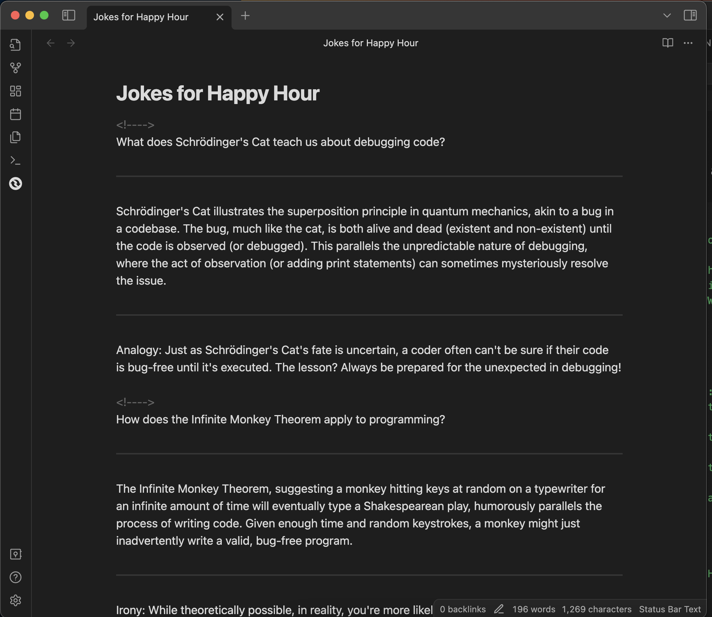
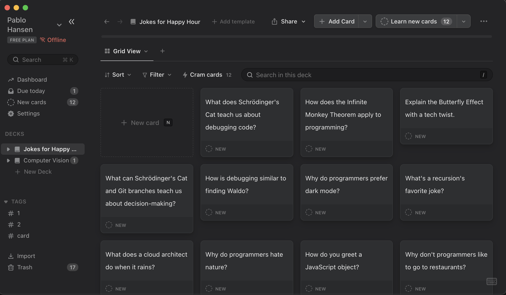

# Obsidian to Mochi!

## Overview

The Obsidian to Mochi! is a custom plugin for Obsidian, a powerful knowledge base that works on top of a local folder of plain text Markdown files. This plugin enables users to convert their Obsidian notes into Mochi cards format, which can then be imported into Mochi for spaced repetition learning. This is particularly useful for users who want to transform their notes into flashcards for more effective studying and recall.

## Features

- **Parse Obsidian Notes:** Converts Obsidian notes into a format compatible with Mochi cards.
- **Flexible Card Format:** Supports multiple fields per card, allowing for comprehensive flashcards.
- **File Export:** Exports the generated Mochi cards as `.mochi` files, ready for import into Mochi.

## Installation

To install the plugin:

1. Download the plugin files from the repository.
2. In Obsidian, open Settings and navigate to the `Community Plugins` section.
3.  Click `Browse` and select the downloaded plugin files.
4. Enable the plugin from the list of installed plugins.

## Usage

### Converting Notes to Mochi Cards

1. **Open a Note:** Open the Obsidian note you wish to convert.
2. **Trigger Conversion:** Click on the Mochi Plugin icon in the left ribbon to start the conversion process.
3. **Review and Save:** Once the conversion is complete, review the generated `.mochi` file and save it to your desired location.

### Note Formatting for Conversion

To ensure your notes are correctly converted:

- Separate cards in your note using `<!---->`. (automatically insert this using `CDM + '`)
- Within each card, separate fields (such as front and back of a card) using `---` or `***`.
- Ensure your notes are free from formatting errors before conversion.

### Importing to Mochi

After converting and saving your notes:

1. Open Mochi and navigate to the import section.
2. Select the saved `.mochi` file to import your new deck.

## Demonstration

### From Markdown to Mochi

Here's how a typical markdown note is transformed into Mochi cards:

**Original Markdown File:**

**Converted Mochi File:**

Original Markdown file [here](./demo/Jokes%20for%20Happy%20Hour.md)

## Support and Contribution

Feel free to open issues to discuss bugs or feature requests! Additionally, my email is on my profile.

If you're feeling generous, [buy me a diet coke!](https://www.buymeacoffee.com/pablohansen)

